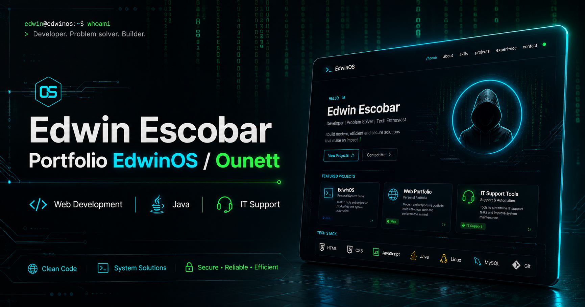

# 🖥️ EdwinOS / Ounett Portfolio

Interactive personal portfolio built with **HTML, CSS and JavaScript**.

This project represents my personal tech identity: **EdwinOS / Ounett**, combining a terminal-inspired interface, Matrix-style visuals, smooth animations, recruiter mode, real project sections and a professional developer profile.

## 🚀 Live Demo

🔗 [View Portfolio](https://ounett.github.io/portfolio/)

## ✨ Features

- Terminal-inspired interface
- Matrix mode
- Custom cursor
- Smooth animations
- Responsive design
- Project showcase
- Recruiter mode
- SEO basics
- GitHub Pages deployment

## 🛠️ Technologies

- HTML
- CSS
- JavaScript
- Git
- GitHub Pages

## 📌 Purpose

The goal of this portfolio is to present my skills, projects and professional profile in a unique and interactive way, while practicing frontend development and personal branding.

## 👤 Author

**Edwin Escobar**  
GitHub: [@Ounett](https://github.com/Ounett)  
Portfolio: [ounett.github.io/portfolio](https://ounett.github.io/portfolio/)
